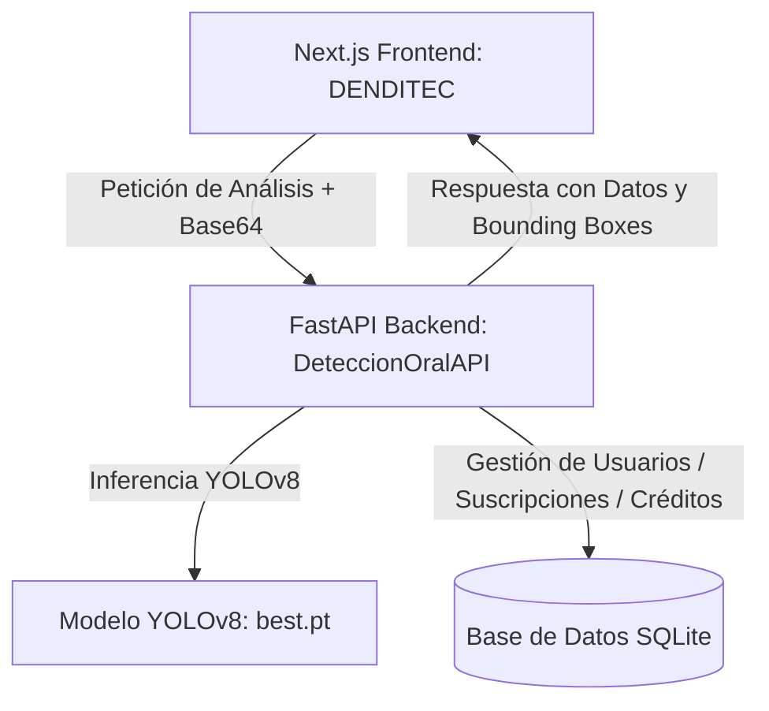

# DenDiTec — Sistema Inteligente de Detección de Enfermedades Orales

Este repositorio contiene el proyecto completo **DenDiTec**, un sistema integral que combina un cliente web moderno (Next.js) y una API de alto rendimiento (FastAPI) para realizar la detección temprana y análisis inteligente de patologías dentales y orales a través de Inteligencia Artificial.

---

## 🏗️ Arquitectura General

El sistema está dividido en dos componentes principales:

1. **`DENDITEC/package` (Frontend)**: Interfaz de usuario interactiva y responsiva creada con Next.js 15, React 19 y Tailwind CSS. Administra el estado de autenticación, visualiza análisis detallados, gestiona planes de suscripción y ofrece un Chatbot interactivo.
2. **`DeteccionOralAPI` (Backend)**: API robusta construida con FastAPI que realiza procesamiento de imágenes en tiempo real y ejecuta un modelo de visión por computadora **YOLOv8** (archivo `best.pt`) para detectar y etiquetar enfermedades orales.



---

## 🚀 Características Clave

* **Detector de Enfermedades Orales por IA**:
  - Carga de imágenes en formato Base64.
  - Procesamiento gráfico para superposición de rectángulos delimitadores (*bounding boxes*) en las áreas con patologías.
  - Detalle detallado del análisis (tiempo de procesamiento, confianza mínima, y modelo usado).
* **Módulo de Chatbot Dental (Dendi)**: Asistente virtual inteligente para resolver dudas frecuentes sobre higiene dental y salud oral.
* **Portal de Planes de Suscripción**:
  - **Plan Gratuito**: Incluye 1050 créditos de análisis iniciales (cada análisis consume 150 créditos) y hasta 2 descargas de reportes PDF.
  - **Planes Premium / VIP / VIP Advanced**: Permiten análisis y descargas ilimitadas durante 7 días, 30 días o 1 año respectivamente.
* **Sistema de Blogs**: Módulo informativo sobre prevención y cuidado oral sustentado mediante archivos estáticos Markdown indexados de forma dinámica.
* **Generación de Reportes PDF**: Exportación local en PDF de los análisis resultantes con límites protegidos por consumo de API.

---

## 🛠️ Tecnologías Utilizadas

### Frontend (`DENDITEC/package`)
* **Framework**: [Next.js 15](https://nextjs.org/) (App Router) y React 19.
* **Estilado**: [Tailwind CSS v4](https://tailwindcss.com/) & [Lucide Icons](https://lucide.dev/).
* **Autenticación**: Contexto personalizado de react (`AuthContext`) integrado con llamadas al backend de FastAPI.
* **Tipado**: [TypeScript](https://www.typescriptlang.org/).
* **Animaciones y Utilidades**: `@iconify/react`, `date-fns`, `jspdf` para reportes.

### Backend (`DeteccionOralAPI`)
* **Framework**: [FastAPI](https://fastapi.tiangolo.com/) y Uvicorn.
* **Visión por Computadora**: [Ultralytics YOLOv8](https://github.com/ultralytics/ultralytics), OpenCV-headless, Pillow, y NumPy.
* **Base de Datos / ORM**: SQLite con SQLAlchemy.
* **Tareas Programadas**: APScheduler para recarga periódica de créditos.
* **Contenedores**: Docker y Docker Compose para empaquetado y despliegue rápido.

---

## ⚙️ Configuración del Entorno

### Backend (`DeteccionOralAPI`)
Crea un archivo `.env` en la raíz de `DeteccionOralAPI/` basado en `.env.example`:
```env
ALLOWED_ORIGINS=http://localhost:3000,http://127.0.0.1:3000,https://denditec.vercel.app
DATABASE_URL=sqlite:///./usuarios.db
# Otras variables de configuración de tu servidor
```

### Frontend (`DENDITEC/package`)
Crea un archivo `.env.local` en la raíz de `DENDITEC/package/`:
```env
NEXT_PUBLIC_API_URL=http://localhost:8000
# Agrega llaves privadas de NextAuth si es necesario
```

---

## 🏃 Cómo Ejecutar el Proyecto Localmente

### 1. Iniciar el Backend (`DeteccionOralAPI`)

Requisitos: **Python 3.10+** (o Docker)

**Usando Entorno Virtual de Python:**
1. Navega a la carpeta del backend:
   ```bash
   cd DeteccionOralAPI
   ```
2. Crea e inicia un entorno virtual:
   ```bash
   python -m venv .venv
   # En Windows:
   .venv\Scripts\activate
   # En macOS/Linux:
   source .venv/bin/activate
   ```
3. Instala las dependencias:
   ```bash
   pip install -r requirements.txt
   ```
4. Ejecuta el servidor uvicorn:
   ```bash
   uvicorn main:app --host 127.0.0.1 --port 8000 --reload
   ```
   *La API estará disponible en `http://localhost:8000`. Puedes ver la documentación interactiva (Swagger) en `http://localhost:8000/docs`.*

**Usando Docker:**
```bash
cd DeteccionOralAPI
docker-compose up --build
```

---

### 2. Iniciar el Frontend (`DENDITEC/package`)

Requisitos: **Node.js 18+**

1. Navega a la carpeta del frontend:
   ```bash
   cd DENDITEC/package
   ```
2. Instala los paquetes requeridos:
   ```bash
   npm install
   ```
3. Inicia el servidor de desarrollo:
   ```bash
   npm run dev
   ```
   *El frontend se abrirá automáticamente en `http://localhost:3000` (o el puerto alternativo indicado).*

---

## 📁 Estructura del Directorio

```text
PROYECTO-IA/
├── DENDITEC/
│   └── package/
│       ├── src/
│       │   ├── app/                # Enrutamiento y Páginas (App Router)
│       │   ├── components/         # Componentes React (Layouts, UI, Auth, etc.)
│       │   └── context/            # Contexto de Autenticación
│       ├── package.json
│       └── tsconfig.json
│
├── DeteccionOralAPI/
│   ├── routes/                 # Rutas de la API (Auth, Detecciones)
│   ├── services/               # Servicio Inferencia YOLOv8 (modelo_yolo.py)
│   ├── main.py                 # Punto de entrada de FastAPI
│   ├── models.py               # Modelos Pydantic y DB
│   ├── database.py             # Configuración de base de datos
│   ├── best.pt                 # Pesos del modelo entrenado YOLOv8
│   ├── Dockerfile
│   └── docker-compose.yml
│
└── README.md                   # Este archivo informativo
```
