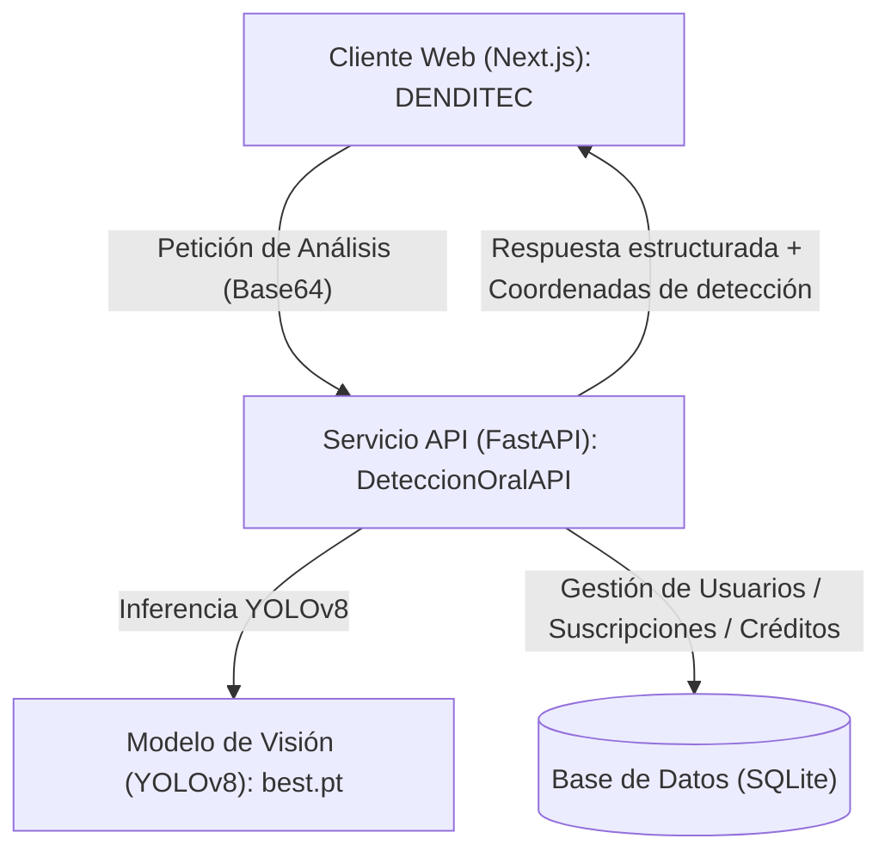

# DenDiTec: Sistema Inteligente de Detección de Patologías Orales

DenDiTec es una solución tecnológica integral diseñada para asistir en la detección temprana y el análisis de patologías dentales y orales a través de Inteligencia Artificial. El sistema combina una interfaz web moderna y responsiva desarrollada en Next.js con una API de alto rendimiento basada en FastAPI, la cual procesa imágenes en tiempo real y ejecuta un modelo de visión por computadora YOLOv8.

---

## Arquitectura del Sistema

El proyecto se compone de dos módulos principales que interactúan de forma desacoplada:

1. **Frontend (DENDITEC/package)**: Interfaz de usuario interactiva estructurada con Next.js 15 y React 19. Implementa la gestión de autenticación, visualización detallada de análisis clínicos, gestión de suscripciones y un canal de comunicación interactivo con un asistente virtual.
2. **Backend (DeteccionOralAPI)**: Servicio web robusto desarrollado en FastAPI que gestiona la lógica de negocio, realiza la persistencia de datos y ejecuta la inferencia del modelo YOLOv8 (`best.pt`) para la localización y clasificación de patologías orales.



---

## Características Principales

### Análisis de Imágenes mediante Inteligencia Artificial
* Procesamiento asíncrono de imágenes enviadas en formato Base64.
* Identificación automática de patologías con retorno de coordenadas y niveles de confianza.
* Superposición precisa de cuadros delimitadores (bounding boxes) coloreados según la categoría detectada.

### Patologías Clínicas Identificadas
El modelo YOLOv8 integrado está entrenado para reconocer y etiquetar las siguientes condiciones:
* **Caries**
* **Gingivitis**
* **Sarro (Calculus)**
* **Úlceras**
* **Hipodoncia**
* **Decoloración dental**

### Asistente Dental Virtual (Dendi)
* Chatbot especializado integrado en la interfaz de usuario para resolver consultas informativas comunes sobre salud e higiene oral.

### Módulo de Suscripción y Gestión de Créditos
* **Plan Gratuito**: Acceso con un cupo inicial de 1050 créditos de análisis (consumo de 150 créditos por consulta) y hasta 2 descargas de reportes PDF.
* **Planes de Pago (Premium / VIP / VIP Advanced)**: Eliminación de límites de análisis y descargas durante el periodo contratado (7 días, 30 días o 365 días, respectivamente).
* **Recarga Automática de Créditos**: Tarea programada mediante APScheduler que restablece periódicamente los créditos de los usuarios activos.

### Sistema de Blog Integrado
* Publicación dinámica de contenido educativo y de prevención odontológica mediante el parsing automático de archivos Markdown estáticos.

### Exportación de Reportes
* Generación local de documentos PDF con el resumen gráfico e informativo del diagnóstico asistido por IA.

---

## Especificaciones Tecnológicas

### Frontend (`DENDITEC/package`)
* **Framework**: Next.js 15 (App Router) y React 19.
* **Estilado**: Tailwind CSS e Iconos de Lucide.
* **Manejo de Estado**: React Context (AuthContext) integrado con la API de autenticación del backend.
* **Lenguaje**: TypeScript.
* **Dependencias Adicionales**: `@iconify/react` para iconografía interactiva, `date-fns` para manipulación de fechas y `jspdf` para la generación de reportes PDF.

### Backend (`DeteccionOralAPI`)
* **Framework**: FastAPI y servidor ASGI Uvicorn.
* **Procesamiento Gráfico y ML**: Ultralytics YOLOv8, OpenCV, Pillow y NumPy.
* **Persistencia**: SQLite como motor base y SQLAlchemy como ORM (fácilmente escalable a PostgreSQL).
* **Planificador de Tareas**: APScheduler para la automatización de recargas.
* **Contenerización**: Configuración lista para Docker y Docker Compose.

---

## Configuración del Entorno

### Configuración del Backend (`DeteccionOralAPI`)
Cree un archivo `.env` en el directorio raíz de `DeteccionOralAPI/` basado en la plantilla `.env.example`:
```env
DATABASE_URL=sqlite:///./usuarios.db
API_HOST=0.0.0.0
API_PORT=8000
ALLOWED_ORIGINS=http://localhost:3000,http://127.0.0.1:3000,https://denditec.vercel.app
```

### Configuración del Frontend (`DENDITEC/package`)
Cree un archivo `.env.local` en el directorio raíz de `DENDITEC/package/`:
```env
NEXT_PUBLIC_API_URL=http://localhost:8000
```

---

## Instrucciones para Ejecución Local

### Ejecución del Backend (`DeteccionOralAPI`)

Requisitos previos: **Python 3.10+** o **Docker**

#### Opción A: Ejecución mediante Entorno Virtual
1. Acceda al directorio del backend:
   ```bash
   cd DeteccionOralAPI
   ```
2. Inicialice y active el entorno virtual:
   ```bash
   python -m venv .venv
   # En Windows:
   .venv\Scripts\activate
   # En macOS/Linux:
   source .venv/bin/activate
   ```
3. Instale las dependencias especificadas:
   ```bash
   pip install -r requirements.txt
   ```
4. Inicie el servidor Uvicorn en modo de recarga automática:
   ```bash
   uvicorn main:app --host 127.0.0.1 --port 8000 --reload
   ```
   * La interfaz interactiva de documentación (Swagger UI) estará disponible en `http://localhost:8000/docs`.
   * La documentación alternativa (ReDoc) estará disponible en `http://localhost:8000/redoc`.

#### Opción B: Ejecución mediante Docker Compose
1. Inicie los contenedores desde el directorio del backend:
   ```bash
   cd DeteccionOralAPI
   ```
2. Compile e inicie el servicio:
   ```bash
   docker-compose up --build
   ```

---

### Ejecución del Frontend (`DENDITEC/package`)

Requisitos previos: **Node.js 18+**

1. Acceda al directorio del frontend:
   ```bash
   cd DENDITEC/package
   ```
2. Instale los módulos de Node especificados:
   ```bash
   npm install
   ```
3. Inicie el servidor de desarrollo:
   ```bash
   npm run dev
   ```
   * El cliente web estará disponible en `http://localhost:3000`.

---

## Estructura de Directorios

```text
PROYECTO-IA/
├── DENDITEC/
│   └── package/
│       ├── src/
│       │   ├── app/                # Definición de rutas y vistas (App Router)
│       │   ├── components/         # Componentes modulares y elementos de interfaz
│       │   └── context/            # Contexto global de autenticación
│       ├── package.json
│       └── tsconfig.json
│
├── DeteccionOralAPI/
│   ├── routes/                 # Controladores y definición de endpoints de la API
│   ├── services/               # Lógica de inferencia YOLOv8 (modelo_yolo.py)
│   ├── main.py                 # Inicialización y configuración del servicio FastAPI
│   ├── models.py               # Modelos Pydantic y entidades relacionales
│   ├── database.py             # Configuración de conexiones a base de datos
│   ├── best.pt                 # Archivo de pesos del modelo YOLOv8 entrenado
│   ├── Dockerfile
│   └── docker-compose.yml
│
└── README.md                   # Documentación técnica del proyecto
```

---

## Descargo de Responsabilidad Clínica

Este software es una herramienta tecnológica de asistencia basada en algoritmos de visión por computadora. Los resultados generados son de carácter informativo y preliminar. No constituyen un diagnóstico clínico profesional, receta médica ni sustituto de la consulta formal con un odontólogo calificado.
